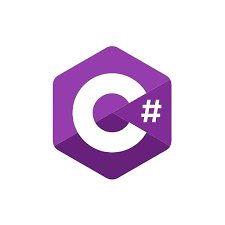
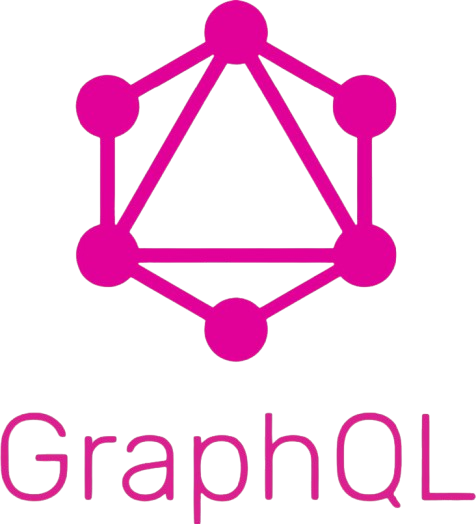

<!-- markdownlint-disable -->
<table>
<tr>
<td width="50%" valign="top">

# &nbsp; **👋Hi, I'm Golam Rabbani Rafi**

- 🔭 I'm presently practicing my back-end developing skills.
- 🌱 Currently, my focus lies in mastering .Net and Nest.js, while diligently constructing projects that facilitate hands-on learning.
- 👯 Seeking to contribute to the open source community, I eagerly welcome collaborations on C#, Java, TypeScript/Javascript projects.
- 😄 With a passion for constant growth, I enjoy exploring novel skills and seamlessly integrating them into my project repertoire.

<h4>
  
  &nbsp; For professional inquiries or meaningful conversations, please reach out to me at !!
</h4>

  
  

  

  

</td>

<td width="50%" valign="top">

### 🛠 &nbsp;Tech I Like

 

 

 

 

 

 

  

</td>
</tr>
</table>

<!-- ===================== ANALYTICS + SUMMARY (SAME ROW) ===================== -->

<table width="100%">
<tr>

<td width="50%" align="center" valign="top">

<h3>📊 GitHub Analytics =:</h3>

  

</td>

<td width="50%" align="center" valign="top">

<h3>📋 Profile Summary</h3>

</td>

</tr>
</table>

<!-- ===================== CONTRIBUTION GRAPH ===================== -->

<h3 align="center">📈 Contribution Activity</h3>

  

